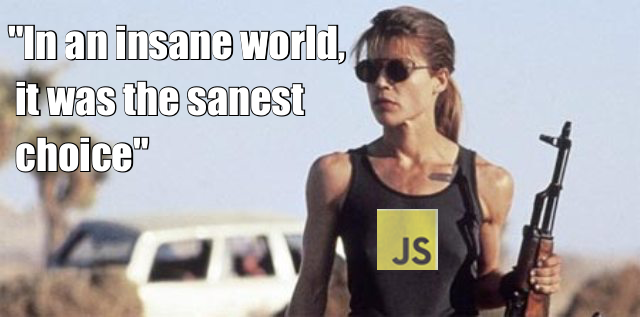

<!-- .slide: data-background="images/patience.gif" -->

## Give it a minute <!-- .element: class="white-shadow" style="margin: 8em 0 0 4em;" -->

???

But... give it 5 minutes
---

<!-- .slide: data-background="images/ivan-code-fellows-teaching.jpg" -->
<!-- .slide: class="translucent" style="margin-top: 4em;" -->

### Web Developer, Teacher & Entrepreneur

- Excellence & Craftsmanship
- Usability & Accessibility
- Diversity & Inclusivity
- Sustainable Lifestyle

???

I stand for:

Based on my experience and talents, I try to bridge the gap between Computer Science and Industry.

---

 <!-- .element: style="width: 150%" -->

### We got JavaScript &mdash; not Scheme

???

If Brendan Eich had his way, we would all be writing Scheme, a functional language, in the browser.

---

### `Undefined is not a function` <!-- .element: class="red" -->

Tony Hoare said inventing `NULL` was his

*Billion Dollar Mistake*

*Why* are we still using it and seeing it every day? <!-- .element: style="margin-top: 8em;" -->

---

HTML5 and CSS are a bit of a mess, too

How do you center an image on the page?

## Why do we have to learn 3 languages? <!-- .element: class="red" -->

---

## Build tools: here to stay

Grunt <!-- .element: class="fragment" -->
, Gulp <!-- .element: class="fragment" -->
, Brunch <!-- .element: class="fragment" -->
, Make <!-- .element: class="fragment" -->, Rake, Jake, <!-- .element: class="fragment" -->
*ad nauseum* <!-- .element: class="fragment" -->

Minification - you should be doing this if you're not <!-- .element: class="fragment" -->

CoffeeScript— pioneered the way, and is still active <!-- .element: class="fragment" -->

Babel — you're compiling JS to JS <!-- .element: class="fragment" -->

React — you're mixing in HTML, CSS, anyway <!-- .element: class="fragment" -->


###*Why not design something nice from the beginning?* <!-- .element: class="fragment red more-margin" -->

???

What would that look like?

---

<!-- slide: data-backgroud-color="#000" -->

> What modern **functional languages** are about is developing **ever-better tools** to help in this style of programming, thus providing easier ways to specify **powerful data types**, manipulate them at a high level, break them apart and recombine them, and to do all this with a degree of **safety** and reusability and without too much syntactic baggage or implementation detail cluttering up the code.


---

## Functional Programming offers&hellip;
- Immutability - Values don't change unexpectedly <!-- .element: class="fragment" -->
- Pure functions - predictable and testable outcomes <!-- .element: class="fragment" -->
- Pattern Matching - clean code over complex if statements <!-- .element: class="fragment" -->
- Declarative vs Imperative <!-- .element: class="fragment" -->
- Scalable <!-- .element: class="fragment" -->
- Reactive <!-- .element: class="fragment" -->

???

Imperative - one instruction after another.
Declarative - describing what you want to have happen

You probably already know a great declarative programming language, SQL.
And CSS is declarative too.

---

## Elm is&hellip;

- The best of functional programming in your browser <!-- .element: class="fragment" -->
- Usable — Targeted towards JavaScript developers <!-- .element: class="fragment" -->
- Inclusive — Evan Czaplicki: "Let's be mainstream" <!-- .element: class="fragment" -->
- Reliable – No runtime exceptions - compilation finds errors <!-- .element: class="fragment" -->
- Fast — Faster than React <!-- .element: class="fragment" -->
- Inspiring — Angular 2.0, Brendan Eich <!-- .element: class="fragment" -->

---

## Example

```elm
import Html exposing (span, text)
import Html.Attributes exposing (class)

main =
  span [class "welcome-message"] [text "Hello, World!"]
```
---

# Don't fear the type system
It's not like Java

---

```elm
import Graphics.Element exposing (..)
import Mouse


main =
  Signal.map show Mouse.position
```

Catching type errors at compile time makes code more reliable (vs runtime)

---

## Binary Tree
```elm
type Tree a = Empty | Node a (Tree a) (Tree a)
```

???

Imagine doing this in Java. One super class and two sub classes just to define a tree in the first place!

Imagine JS. It is not quite as bad at first,

but imagine trying to refactor the resulting code later if you need to change the core representation.

Sneaky breakages everywhere!

---

### Dev Environment and workflow
- Atom
```
apm install linter linter-elm-make language-elm
```
- Vim
  - https://github.com/ElmCast/elm-vim

- Elm Brunch
  - https://github.com/ivanoats/elm-brunch-starter

---

## Demonstration of
## Elm Brunch

---

### Other Elm Resources

- [Pragmatic Studio](https://pragmaticstudio.com/elm) video tutorials
- [Elm Discuss](https://groups.google.com/forum/?fromgroups#!forum/elm-discuss) mailing list
- [#elm](seattlehacks.herokuapp.com) channel on seattlehacks Slack
- [Elmcasts.io](http://elmcasts.io)

---

### People to follow:
- [Evan Czaplicki](https://twitter.com/evancz)
- [Richard Feldman](https://twitter.com/rtfeldman)
- [Yan Cui](https://twitter.com/theburningmonk)
- [Pete Vilter](https://twitter.com/)
- [Ivan Storck](https://twitter.com/ivanoats)

---
### Organizations on Twitter:
- [Elm](https://twitter.com/elmlang)
- [ElmSeattle](https://twitter.com/elmseattle)
